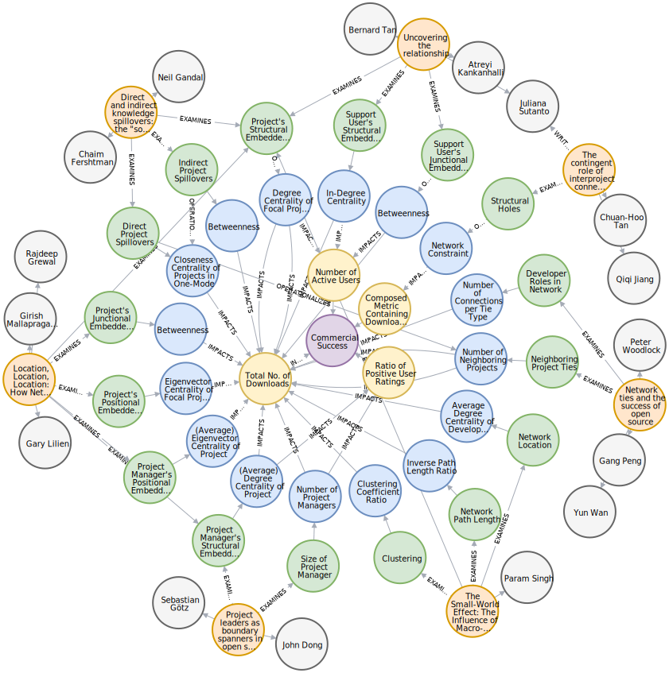

# Influence of Network Structures on Open Source Projects

### Online Appendix
This repository provides two supplements: 
1. A **database dump file** which encodes the publications presented in the thesis in form of a graph and
1. a **jupyter notebook script** which calculates various centrality metrics

The database dump file can be imported into `Neo4j`, you have two possible options:
* Drop the database file into the `Files` area of a project in `Neo4j Desktop` (download it [here](https://neo4j.com/download/)). Then, choose in the file options menu `Create new DBMS from dump`. 
* Use the `neo4j-admin tool` to load data from the command line. Use the following command:  
`bin/neo4j-admin load --from <path to dump file>`

 
 

*Figure 1. Overview of network structures’ influence on commercial success in the form of a graph.*
